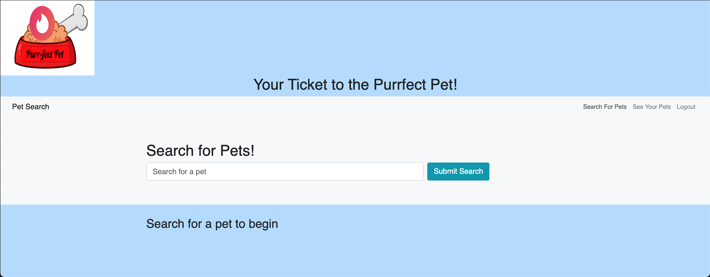

# Purrfect Pet

### License
  
***

## Description
Purrfect Pet is an application that allows users to select a wide variety of pets in a style reminiscent of dating apps (e.g. Tinder). Users can create an account and put a search term (e.g. dog, cat) in the search bar at the top, and in turn, receive a gallery of their searched pets one photo at a time. Pets that are swiped to the right are saved to the users' Favorite Pets page, and pets that are swiped to the left are not.
***

## Table of Contents
1. [Technologies Used](#technologies)
2. [Screenshots](#screenshots)
3. [Links](#links)
***

## Technologies Used
  
* GraphQL

* Apollo

* React.js

* MongoDB

* Mongoose ODM

* Heroku

* JWT

* PWA (service worker)

***

## Screenshots

***

## Links

[Deployed-Application](https://purrfect-pet-app.herokuapp.com/)

[Repo-Link](https://github.com/kayladong229/purrfect-pet)
***